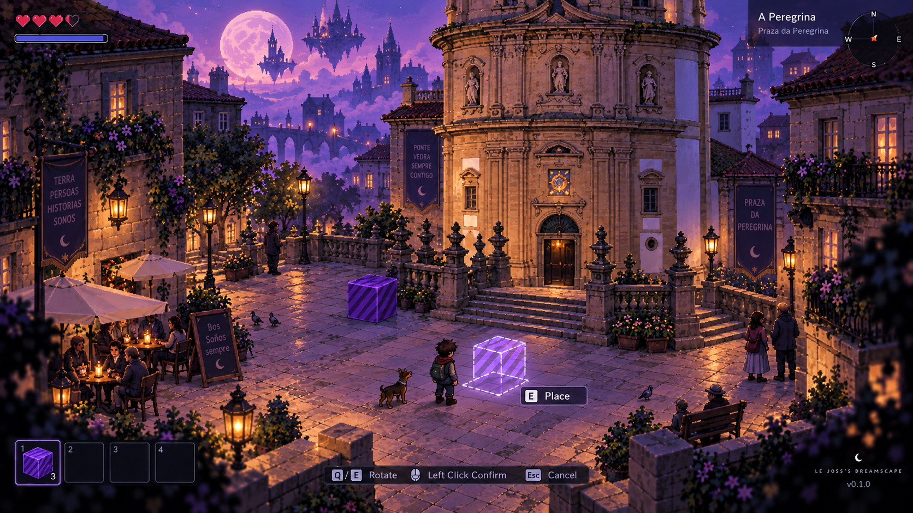

# Le Joss's Dreamscape

[Play the Web prototype](https://dreamscape.198.244.233.153.sslip.io/)

*Visual concept for the project's direction, not a screenshot of the current build.*

An explorable, stylized 3D world grounded in recognizable reality. A familiar home world gives the player an anchor; Dreamscape emerges as that reality begins to fracture. Crafting, exploration, and RPG-like activities support this identity rather than define its limits.

Real cities and fictionalized places can intersect with memories, dreams, alternate timelines, parallel universes, distant planets, and impossible architecture. An ordinary door might open into another time; a building might contain an impossible interior; a familiar location might later behave differently. The journey can lead from reality through an anomaly into somewhere impossible and back, with lasting connections between those experiences rather than isolated, disposable levels.

Objects can provide those connections. A strange radio discovered in an alternate 1980s city might eventually sit on a shelf in the player's present-day home. Items and player state may cross selected boundaries; not every place has to share the same rules. Object provenance could later become part of discovery and storytelling, but history tracking is not being built now.

## Material world and home

Inspired by Ultima Online's materially interactive world philosophy, objects should be able to leave the world, enter an inventory, and return as physical objects. Long-term possibilities include picking up, dropping, placing, moving, rotating, crafting, storing, trading, and leaving objects in persistent locations. An inventory entry should preserve the object it represents.

Persistent player housing is a long-term pillar: personally arranged spaces filled with crafted furniture, ordinary belongings, discoveries, trophies, and artifacts from dreams or alternate realities. The intended interaction is physical placement and rotation, eventually on floors, tables, shelves, and in containers, rather than decoration slots alone. Housing, persistence, trading, containers, and cross-reality travel are not part of the first slice. This philosophy does not require MMO infrastructure today.

## Visual direction and platforms

Visual direction: deliberate low-poly forms, selective low-resolution textures, pixel-art and late-90s computer influences, atmosphere, and a distinctive palette. Modern rendering is useful only when it serves that direction and the browser budget.

Prefer richer interaction and simulation over excessive graphical fidelity: a movable chair, bottle, fish, book, or dream artifact contributes more to this world than expensive surface detail. This guides future tradeoffs, not premature optimization work.

Real-world reconstruction tools such as LingBot-Map may later supply starting geometry. Those places can be simplified, stylized, fictionalized, or radically transformed. Reconstruction stays an offline authoring concern, independent of gameplay architecture; no integration is planned for Spec 001.

Platform priority: Web, macOS development, Android, iOS, possibly other desktop targets. Longer-term activities include interiors, NPCs, fishing, and crafting. Networking, accounts, servers, databases, cloud infrastructure, and persistent housing technology remain future work.

## Documentation

- [Repository and minimal architecture](docs/architecture.md)
- [Spec 001: vertical slice](docs/specs/001-vertical-slice.md)
- [Spec 006: branded boot splash](docs/specs/006-boot-branding.md)
- [Spec 002: street traversal and pixel trial](docs/specs/002-street-trial.md)
- [Spec 003: Astra and economical-agent workflow](docs/specs/003-agent-workflow.md)
- [Delegable task template](docs/plans/task-template.md)
- [Plan and execution status: Joss animation and street art](docs/plans/008-joss-animation-and-street-art.md)
- [Spec index, English authoring rules and template](docs/specs/README.md)
- [Plan index](docs/plans/README.md)
- [General roadmap proposal](docs/roadmap.md)
- [Development environment and Web risks](docs/development.md)
- [OVH deployment and operations](deploy/ovh/README.md)
- [ADR 001: engine and Web baseline](docs/adr/001-engine-and-web-baseline.md)
- [ADR 002: offline asset boundary](docs/adr/002-offline-asset-boundary.md)
- [ADR 003: item identity across world and inventory](docs/adr/003-item-identity-and-world-representation.md)
- [Asset workspace](assets/README.md)

The public prototype opens the scanned street with eight-direction walking animation,
smooth wall transparency, and a movable violet block near spawn. Press **E** to
pick it up, **P** to place, aim with the mouse, **Q/E** to rotate, left-click to
confirm, and **Esc** to cancel. Placement follows the supported street surface.
The current scenery pass uses coarse pixel foliage, simple stone banks and a
reduced palette in place of the visible scan's noisy surfaces, preserving the
dark asphalt and garage approach.

## Working method

Keep a short spec with scope and observable acceptance criteria. Implement one small step, verify it, and record the result against that spec. Adjust a draft when playtesting changes the design. Use an ADR for a durable cross-cutting decision with a meaningful alternative, not filenames, button labels, or routine implementation details.

No framework, backend, dependency stack, or multiplayer abstraction is needed for Spec 001. No project license has been chosen; dependency licenses do not determine this project's license.
