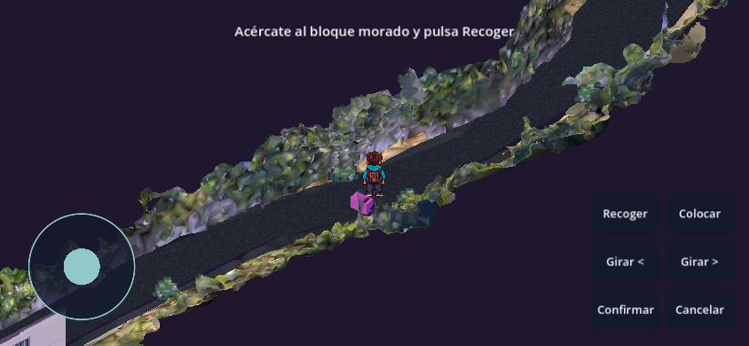
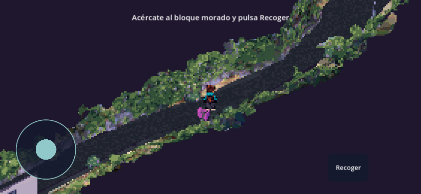
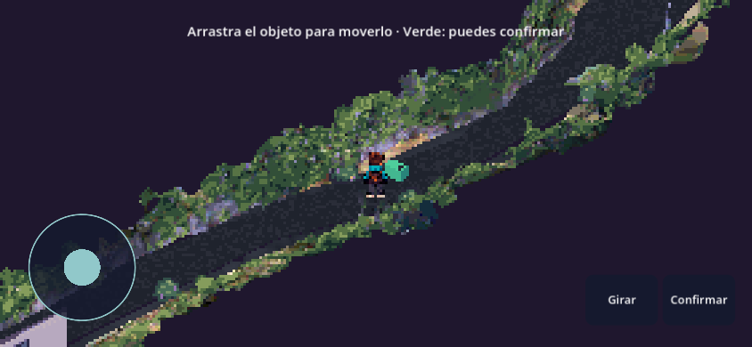

# Beta 01 — Referencia de comparación

Etiqueta reproducible: `beta-01-touch-pixels`.
Capturas de Edge 152 con emulación móvil a 844×390, escala de dispositivo 1,
misma posición inicial de la calle. No representan pruebas físicas Android/iOS.

| Anterior | Beta 01 |
| --- | --- |
|  |  |

Antes: commit de juego `9842a9b`, unos 360 píxeles verticales y paleta del escaneo
de 16 niveles por canal. Beta: unos 180 píxeles verticales, bloques enteros de
al menos 2 píxeles, paleta de 8 niveles, cuatro tonos verdes para vegetación y
grano de asfalto a 8 celdas/metro. Se conserva el HUD nítido y la misma geometría.

Recoger → Colocar → aparece delante → Girar/Confirmar. Arrastrar la previsualización
permite situarla manualmente. Esta referencia queda guardada aunque la URL pública
reciba otra publicación; no implica aceptación artística final del desarrollador.
